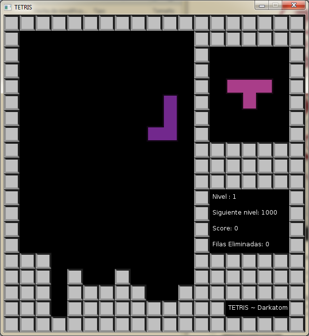

Tetris-co
=============
This is a Tetris game programmed with Lua and LÖVE2D 0.8.0 library. 
I programmed it with the intention of teaching others how to program in Lua and LÖVE2D while having fun with it.

Controls
-----------------------------------------------------
Up Arrow : Change piece position  
Left Arrow : Move piece to the left   
Right Arrow : Move it to the right   
Down Arrow : Currently nothing  

How to use it
-----------------------------------------------------
The only thing you need is [LÖVE2D](http://love2d.org/). Just download the v.0.8.0 and follow the steps.
To execute it, click and drag the root folder of the game to the LÖVE2D.exe icon. If this does not work, check [LÖVE2D webpage](http://love2d.org/) for other methods.
<i>NOTE: Newer versions might not work properly for this game.</i>

Known Bugs
-----------------------------------------------------
Sometimes after reaching lvl 4 the chain of pieces may suddenly stop, but the game does not crash.

License
-----------------------------------------------------
"Tetris" was originally developed by Alekséi Pázhitnov. No copyright or IP infringement intended. The code in this redo is subjected to the LPGL v3 license.
